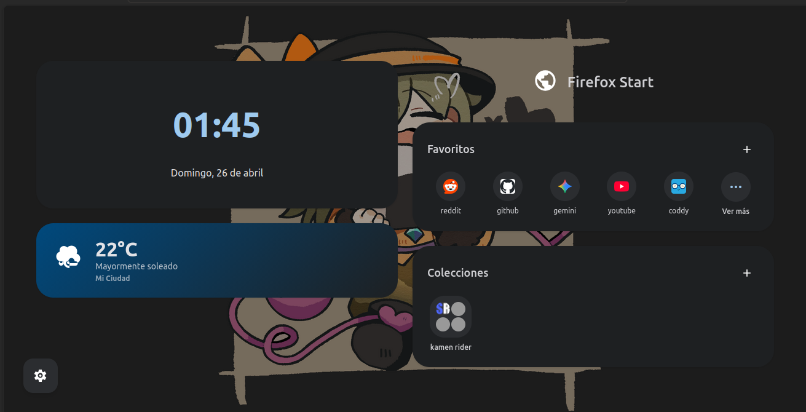

# Material Design 3 New Tab Page

Una página de inicio (New Tab) ligera y personalizable.

## Características Principales

- **Estética Material Design 3**
- **Gestión de Sitios**: 
  - **Favoritos**: Permite personalizar cuadrícula (una sola fila o expansión múltiple).
  - **Colecciones (Carpetas)**: Agrupa enlaces.
- **Obtención de Favicons**: Consigue automáticamente los logos usando Google Favicon API. Cuenta con un fallback para recuperar iconos de la propia red local (`/favicon.ico`).
- **Fondos de Pantalla**: Un selector visual rápido de fondos con carga nativa que almacena las imágenes pesadas de forma asíncrona dentro de `IndexedDB`.
- **Personalización de Interfaz**:
  - Panel lateral integrado y reactivo.
  - Opciones de temas: **Claro** y **Oscuro**.
  - Apariencia de Tarjetas: **Sólida**, **Blur** o **Transparente**.

> [!NOTE]
> La información se almacena de forma local usando únicamente la estructura `localStorage` e `IndexedDB` nativa del navegador.
